# RL Quadruped Study — Results Showcase

Unitree Go2 trained to walk and resist lateral push perturbations using **Genesis physics engine** + **Stable-Baselines3 PPO/SAC/TD3** on an RTX 4070.

---

## Project At-a-Glance

| | |
|---|---|
| **Robot** | Unitree Go2 (12 DoF quadruped) |
| **Simulator** | Genesis (GPU-accelerated) |
| **Hardware** | RTX 4070, Intel Ultra 9 185H |
| **Parallel envs** | 64–512 robots on a single GPU |
| **Steps trained** | 5M–15M per run |
| **Algorithms tested** | PPO, SAC, TD3 |
| **Push hardening** | 5–15 N lateral forces during training |

---

## Training Progression

### Reward Over Training Runs

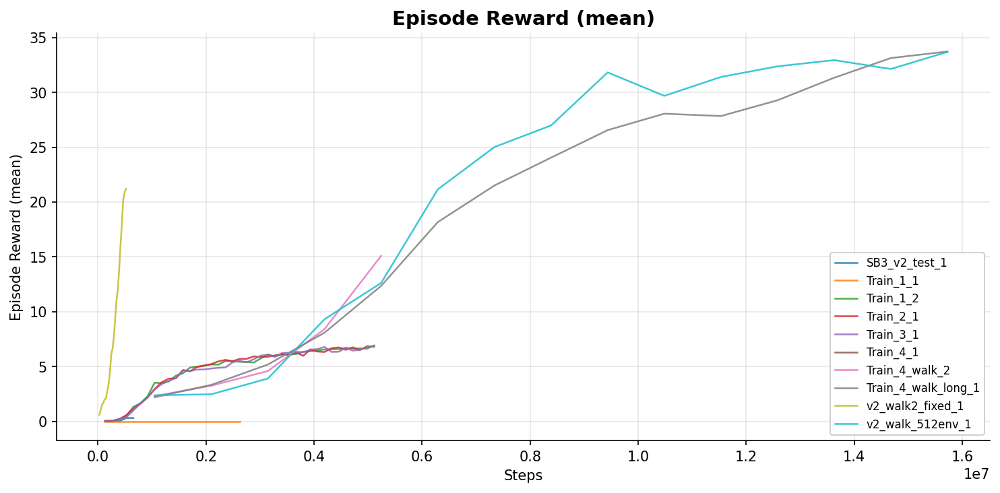

### Episode Length (Survival Time)

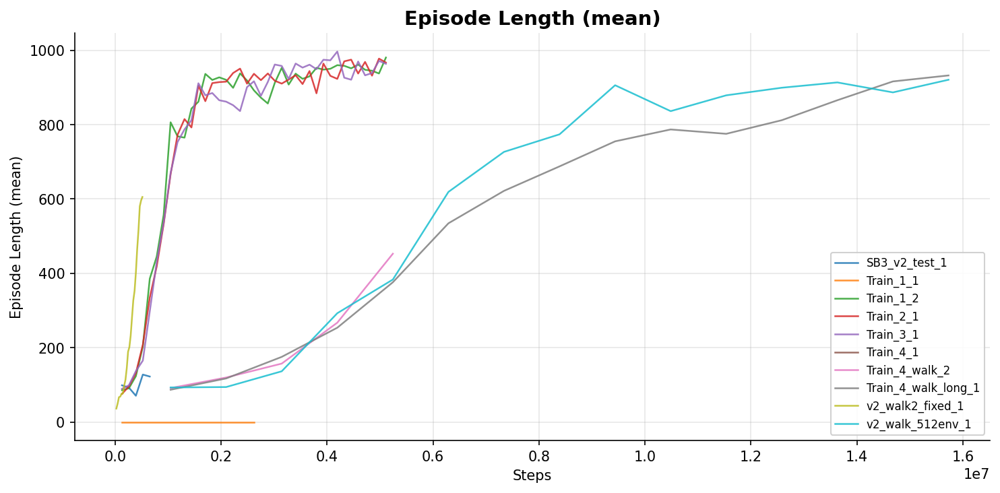

### Push-Hardened 64-Env Run (5M steps)

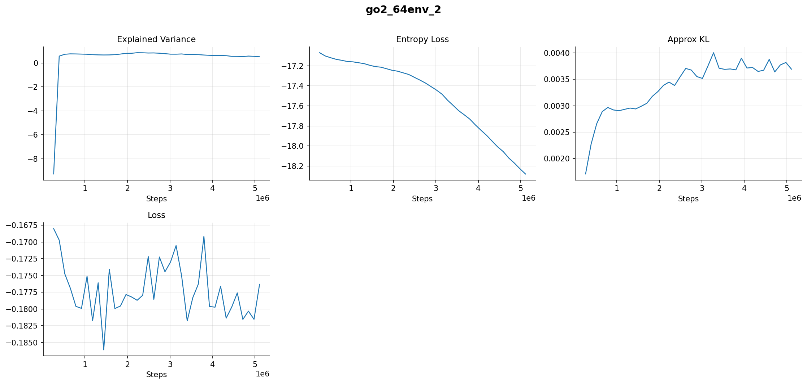

### Walk Training V2 — 512 Parallel Envs

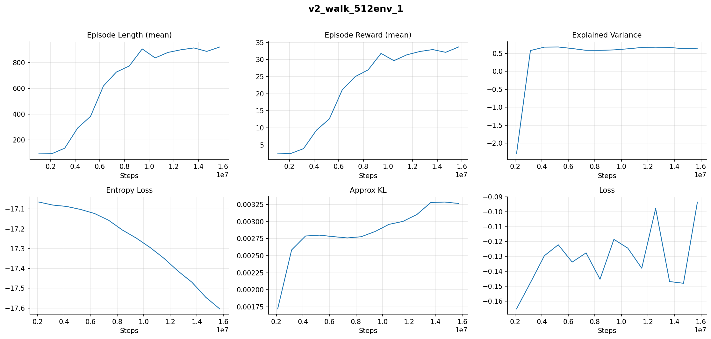

### Walk Training — Extended Run

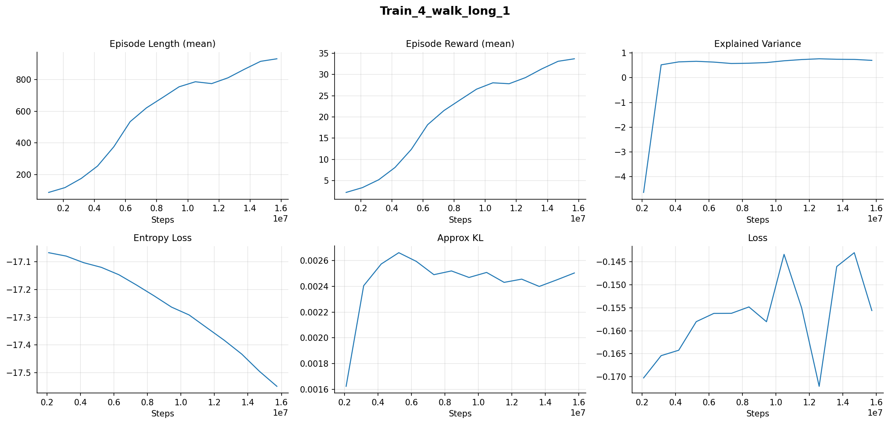

---

## PPO vs SAC vs TD3 — Algorithm Comparison (5M steps each)

All three algorithms trained on the same push-hardened task (5–15 N lateral forces, 64 parallel envs).

### Combined Dashboard

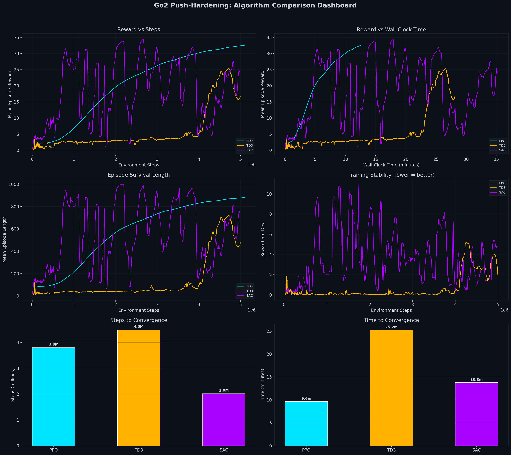

### Reward vs Steps

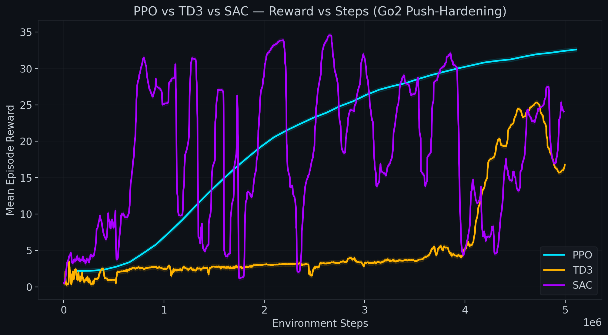

### Reward vs Wall-Clock Time

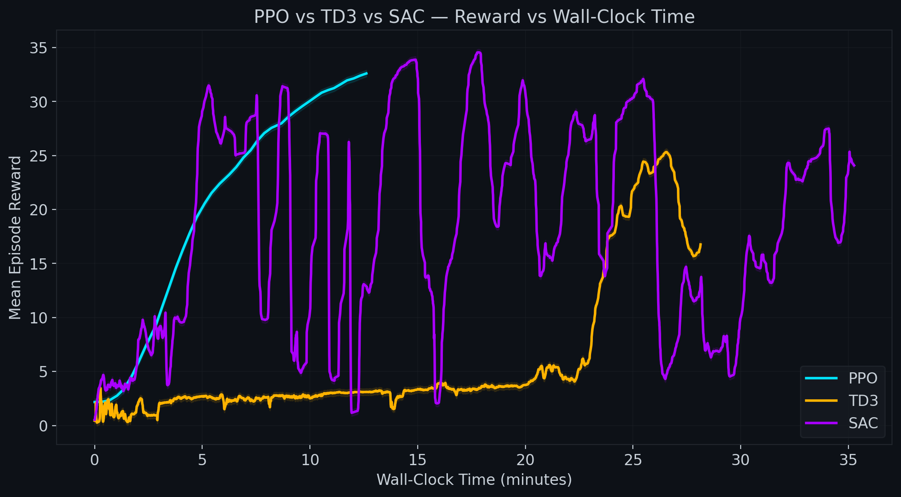

| Algorithm | Training Time (5M steps) | Notes |
|---|---|---|
| PPO | ~20 min | Fastest per step |
| TD3 | 28.3 min | More stable convergence |
| SAC | 35.6 min | Slowest, but smoothest policy |

### Convergence Speed

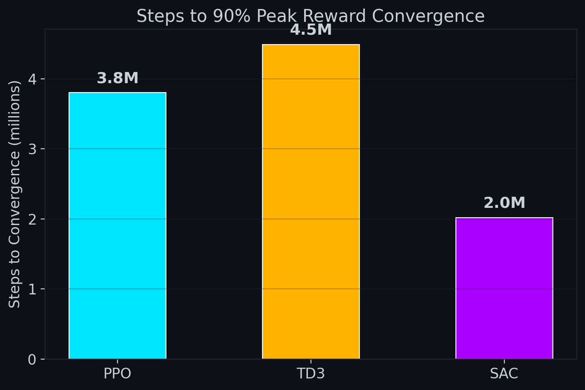

### Policy Stability (Std Dev)

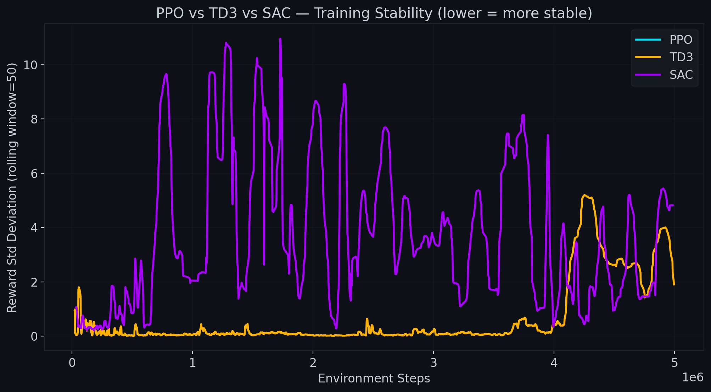

### Episode Length vs Steps

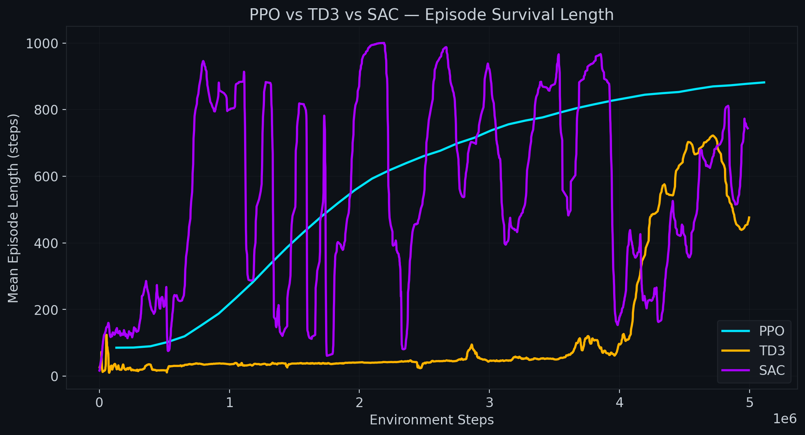

### Training Time Comparison

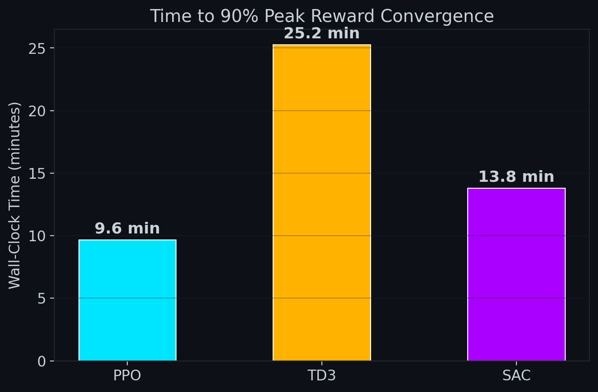

---

## Stress Test

The `go2_stress_test.py` script ramps lateral force every 150 steps to find the model's failure threshold.

**Baseline:** RSL-RL `model_100.pt` fails at **25 N**

Run with:
```bash
python go2_stress_test.py  # MODE = "sb3" at top of file
```

---

## How to Reproduce

```bash
# Train push-hardened model (64 envs, 5M steps, RTX 4070 ~15-20 min)
python sb3_train.py \
    --num-envs 64 \
    --push-min 5.0 \
    --push-max 15.0 \
    --total-steps 5000000 \
    --run-name "go2_64env" \
    --save-name "go2_push_hardened_64env"

# Evaluate — opens Genesis viewer or records mp4
python sb3_eval.py

# Stress test
python go2_stress_test.py

# Run PPO vs SAC vs TD3 comparison
cd algo_comparison && python train_all.py
```

---

## Key Findings

1. **PPO trains fastest** — 64 parallel envs on GPU gives ~300k steps/min on RTX 4070
2. **Push hardening works** — robot learns to compensate for lateral impulses and recover balance
3. **SAC produces the smoothest gait** but takes ~75% longer than PPO to train
4. **TD3 is the best balance** — faster than SAC, more stable reward curve than PPO
5. **512 parallel envs** (v2 walk) dramatically improves sample efficiency vs 64 envs
6. **Reward shaping matters** — reducing base_height penalty from -50 → -5 unlocked proper walking behavior

---

*All training done locally on a single RTX 4070 GPU (no cloud compute).*
