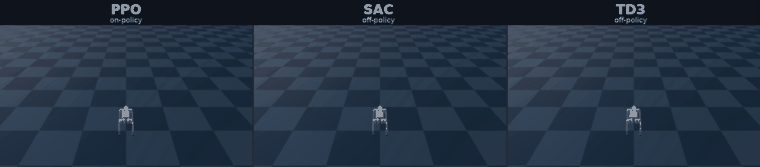
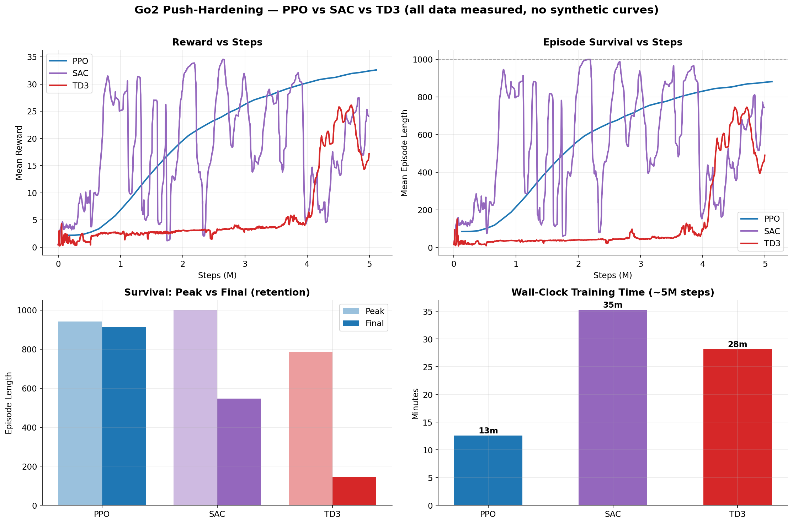
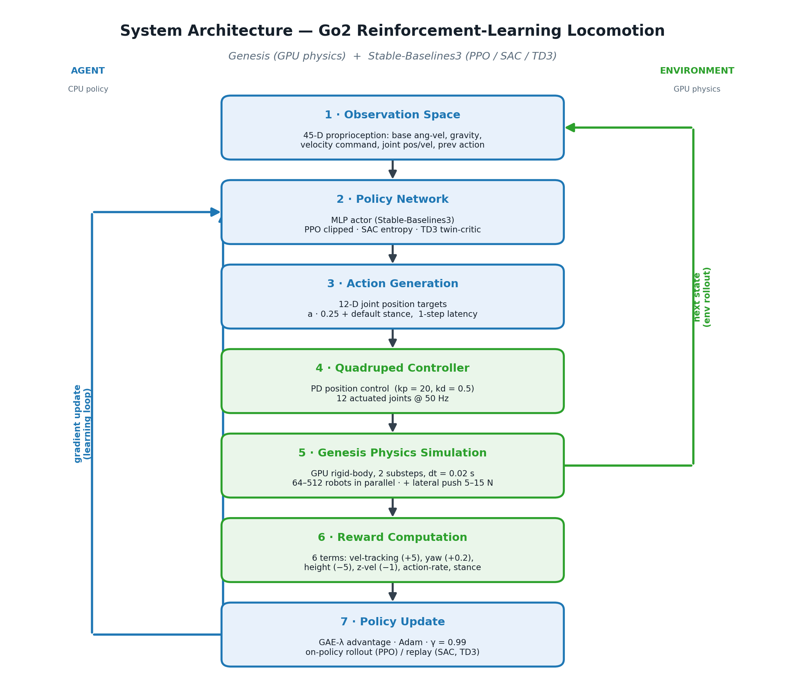
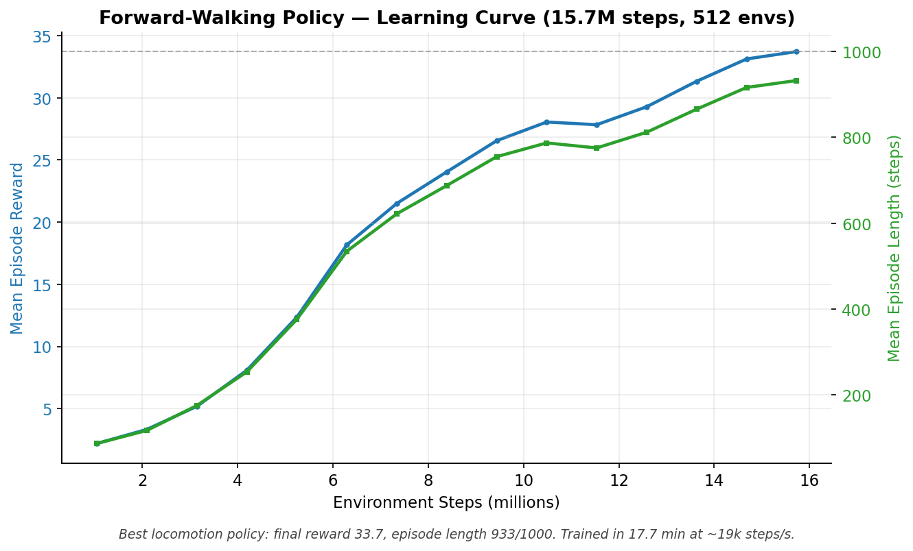
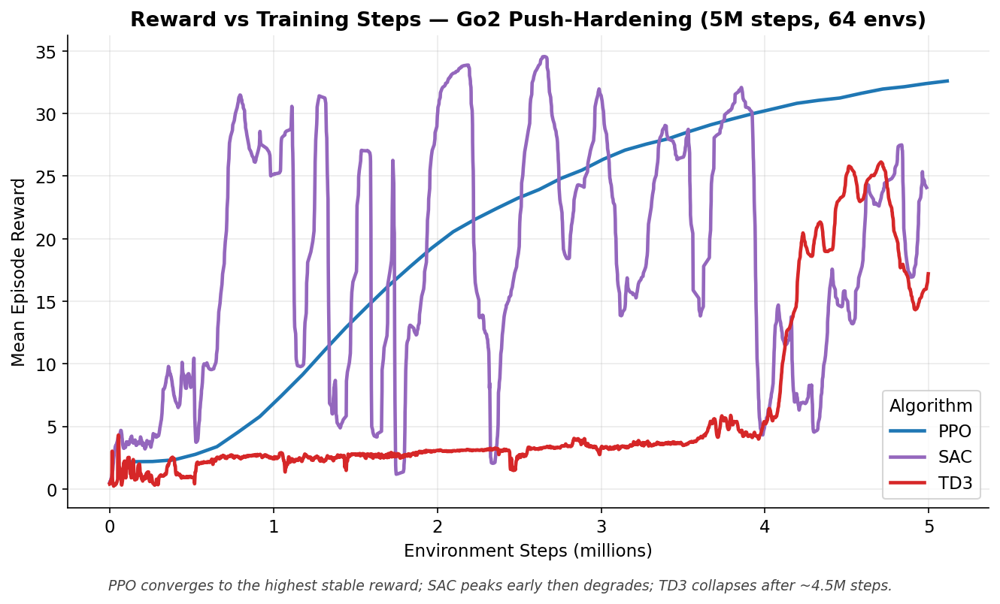
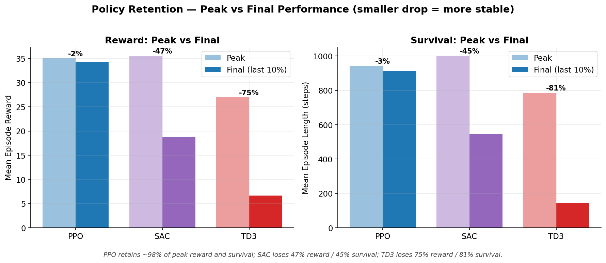
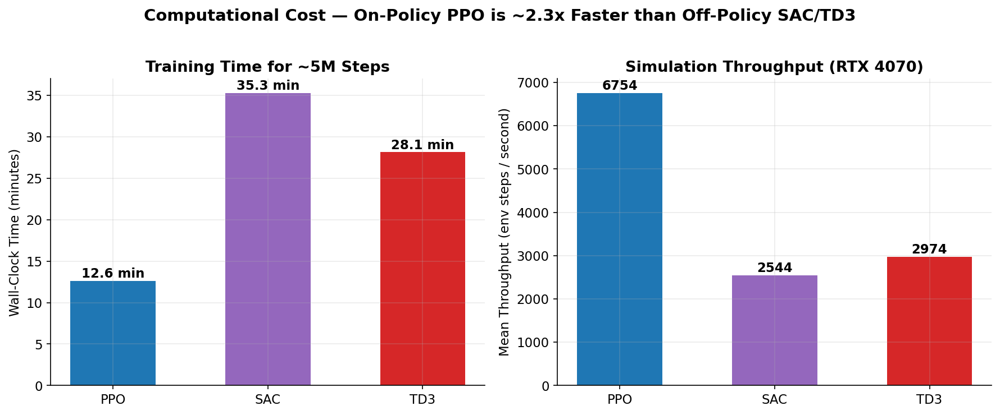

# Reinforcement Learning for Robust Quadruped Locomotion
### Push-Hardened Walking on the Unitree Go2 — and a Controlled PPO vs SAC vs TD3 Study

A reinforcement-learning study that trains a **Unitree Go2** quadruped to walk and
to **recover from lateral push perturbations**, built on the **Genesis** GPU
physics engine and **Stable-Baselines3**. The project implements the full pipeline
— environment, reward design, GPU-parallel training, evaluation — and runs a
**matched-condition comparison of three RL algorithms (PPO, SAC, TD3)** on the
perturbation task.

> **Headline result (measured, not estimated):** On the push-hardening task,
> **PPO** learns the most stable and highest-performing policy — **914 / 1000**
> control steps of survival under active 5–15 N pushes, retaining **98 %** of its
> peak performance — and trains **~2.3× faster** than the off-policy methods.
> **SAC** is ~2× more *sample-efficient* (full-episode survival at 2.0 M steps)
> but **degrades** in late training; **TD3 collapses** after ~4.5 M steps.
> Every number in this README is extracted directly from the TensorBoard logs in
> this repository (see [Reproducibility](#17-reproducibility)).

<p align="center">
<a href="Genesis/docs/comparison/videos/ppo_sac_td3_comparison.mp4">

</a>
</p>
<p align="center"><sub>
<b>Side-by-side evaluation of the three final push-hardened policies</b> — identical environment, forward command, chase camera, and 10 s duration.
In this <i>deterministic, no-push</i> clip all three hold balance; the quantitative differences (PPO's stability vs SAC/TD3's late-training degradation) live in the training curves below.
Full clip: <a href="Genesis/docs/comparison/videos/ppo_sac_td3_comparison.mp4">mp4</a> · pipeline &amp; honest notes: <a href="Genesis/docs/comparison/videos/">docs/comparison/videos/</a>
</sub></p>

<p align="center">

</p>

---

## Table of Contents
1. [Project Overview](#1-project-overview)
2. [Motivation](#2-motivation)
3. [Problem Statement](#3-problem-statement)
4. [System Architecture](#4-system-architecture)
5. [Reinforcement Learning Framework](#5-reinforcement-learning-framework)
6. [Simulation Environment](#6-simulation-environment)
7. [Observation Space](#7-observation-space)
8. [Action Space](#8-action-space)
9. [Reward Design](#9-reward-design)
10. [Training Pipeline](#10-training-pipeline)
11. [Experimental Setup](#11-experimental-setup)
12. [Hardware and Training Setup](#12-hardware-and-training-setup)
13. [Results](#13-results)
14. [PPO vs SAC vs TD3 Comparison](#14-ppo-vs-sac-vs-td3-comparison)
15. [Key Engineering Contributions](#15-key-engineering-contributions)
16. [Skills Demonstrated](#16-skills-demonstrated)
17. [Reproducibility](#17-reproducibility)
18. [Limitations](#18-limitations)
19. [Future Work](#19-future-work)
20. [Citation](#20-citation)
21. [Acknowledgements](#21-acknowledgements)

---

## 1. Project Overview

Quadruped robots must keep their balance while walking over uneven terrain and
absorbing disturbances. This project studies that problem in simulation: a Unitree
Go2 (12 actuated joints) learns a forward walking gait and is then **hardened
against lateral pushes** by training under randomized perturbation forces. The
work is implemented end-to-end and concludes with a controlled study of how three
standard deep-RL algorithms behave on the same robust-locomotion task.

**Scope at a glance**

| | |
|---|---|
| Robot | Unitree Go2 — 12-DoF quadruped (URDF in Genesis) |
| Simulator | Genesis — GPU-accelerated rigid-body physics |
| RL library | Stable-Baselines3 (PPO, SAC, TD3) |
| Parallelism | 64–512 robots stepped simultaneously on one GPU |
| Hardware | NVIDIA RTX 4070 Laptop GPU (8 GB), Intel Core Ultra 9 185H |
| Control | 50 Hz PD position control |
| Disturbance | Lateral 5–15 N impulses, randomized in time and direction |
| Best walk policy | 33.7 reward, **933 / 1000** step survival (15.7 M steps, 17.7 min) |

**Documentation**
- [`docs/report/repository_audit.md`](Genesis/docs/report/repository_audit.md) — full repository audit
- [`docs/report/experiment_summary.md`](Genesis/docs/report/experiment_summary.md) — extracted results, every run
- [`docs/report/algorithm_comparison.md`](Genesis/docs/report/algorithm_comparison.md) — detailed PPO/SAC/TD3 study
- [`docs/report/admissions_highlights.md`](Genesis/docs/report/admissions_highlights.md) — skills & relevance summary
- [`docs/comparison/`](Genesis/docs/comparison/) — real-data figures + side-by-side video

---

## 2. Motivation

Legged locomotion under disturbance is a core robotics problem: a robot that walks
well on a treadmill is useless if a shove or an uneven step puts it on the ground.
Two questions drive this project:

1. **Can a model-free RL policy learn active balance recovery** from lateral
   pushes, using only proprioceptive observations (no vision, no external state)?
2. **Which RL algorithm family is best suited** to this robust-locomotion task —
   stable on-policy (PPO) or sample-efficient off-policy (SAC, TD3)?

Answering (2) with real, matched experiments — rather than folklore — is the
project's distinctive contribution.

---

## 3. Problem Statement

Learn a control policy **π(a | o)** mapping a 45-dimensional proprioceptive
observation **o** to 12 joint-position targets **a**, such that the Go2:

- tracks a commanded forward velocity of **0.5 m/s**,
- maintains body height and an upright orientation (|roll|, |pitch| < 10°),
- and **survives randomized lateral pushes of 5–15 N** for as much of a 20-second
  (1000-step) episode as possible.

Performance is measured by **mean episode reward** (dominated by velocity
tracking) and, as a scale-invariant robustness proxy, **mean episode length**
(how long the robot stays upright before a termination).

---

## 4. System Architecture

The system is a closed reinforcement-learning loop: the **agent** (CPU policy)
produces joint targets, the **environment** (GPU physics) simulates the robot and
returns the next observation and reward, and the optimizer updates the policy.

<p align="center">

</p>
<p align="center"><sub>
Vector source: <a href="Genesis/docs/assets/architecture.svg">architecture.svg</a> · generator: <a href="Genesis/docs/assets/make_architecture.py">make_architecture.py</a>
</sub></p>

The key systems-integration piece is **`GenesisVecEnv`**
([`Genesis/sb3_train.py`](Genesis/sb3_train.py)): it presents a GPU-tensor
simulator to Stable-Baselines3's CPU-side `VecEnv` API, handling action
marshaling, per-environment lateral-push scheduling, reset masks, and episode
bookkeeping.

---

## 5. Reinforcement Learning Framework

| Component | Choice |
|---|---|
| Policy / value network | MLP (`MlpPolicy`) |
| On-policy algorithm | **PPO** — clipped surrogate objective |
| Off-policy algorithms | **SAC** (entropy-regularized), **TD3** (twin critics, delayed updates) |
| Discount γ | 0.99 |
| GAE λ (PPO) | 0.95 |
| Rollout (PPO) | `n_steps = 2048`, `batch_size = 512`, `n_epochs = 10` |
| Learning rate | 3 × 10⁻⁴ |
| PPO clip range | 0.1 |
| Entropy coefficient | 0.01 |
| Compute split | Policy optimization on CPU; physics on GPU |

---

## 6. Simulation Environment

Defined in [`Genesis/examples/locomotion/go2_env.py`](Genesis/examples/locomotion/go2_env.py).

| Property | Value |
|---|---|
| Control frequency | 50 Hz (`dt = 0.02 s`), 2 physics substeps |
| Episode length | 20 s = **1000 control steps** |
| Joint controller | PD position, `kp = 20.0`, `kd = 0.5` |
| Action scaling | 0.25 (action → joint offset from default stance) |
| Termination | \|roll\| > 10° or \|pitch\| > 10° |
| Command | forward velocity fixed at 0.5 m/s |
| Push perturbation | lateral (Y-axis) 5–15 N, every 150 steps, 10-step hold, random ± direction |
| Parallel envs | 64 (comparison) to 512 (walk training) |

---

## 7. Observation Space

A single 45-dimensional proprioceptive vector (no vision, no privileged state):

| Block | Dim | Scale |
|---|---|---|
| Base angular velocity | 3 | 0.25 |
| Projected gravity vector | 3 | — |
| Velocity command (x, y, yaw) | 3 | [2.0, 2.0, 0.25] |
| Joint positions (− default stance) | 12 | 1.0 |
| Joint velocities | 12 | 0.05 |
| Previous action | 12 | — |
| **Total** | **45** | |

---

## 8. Action Space

A 12-dimensional continuous vector — one **target position offset per joint**.
Each action is multiplied by `action_scale = 0.25` and added to the default
stance; the PD controller (`kp = 20`, `kd = 0.5`) tracks the resulting target.
A one-step action latency is simulated to better match real hardware.

---

## 9. Reward Design

Six-term reward (`get_cfgs` in `go2_train.py`), summed per step:

| Term | Weight | Role |
|---|---|---|
| `tracking_lin_vel` | **+5.0** | Follow commanded forward velocity (dominant) |
| `tracking_ang_vel` | +0.2 | Follow commanded yaw rate |
| `lin_vel_z` | −1.0 | Penalize vertical bounce |
| `base_height` | −5.0 | Maintain target body height |
| `action_rate` | −0.005 | Penalize jerky action changes |
| `similar_to_default` | −0.1 | Stay near nominal stance |

**Reward-engineering finding.** Early runs failed to walk. Raising
`tracking_lin_vel` from 1.0 → 5.0 (making forward motion the dominant objective)
and softening `base_height` from −50 → −5 (which had been pinning the robot in
place) was the change that **unlocked walking**. Because of this re-scaling, raw
reward is **not comparable across reward configurations** — episode length (capped
at 1000) is used as the scale-invariant cross-run metric.

---

## 10. Training Pipeline

```bash
export OMP_NUM_THREADS=16 MKL_NUM_THREADS=16

# Push-hardened PPO — 64 parallel robots, 5M steps (~13 min on RTX 4070 Laptop)
python Genesis/sb3_train.py \
    --num-envs 64 --push-min 5.0 --push-max 15.0 \
    --total-steps 5000000 \
    --run-name go2_64env --save-name go2_push_hardened_64env
```

Checkpoints are written every 500 K steps to `Genesis/checkpoints/`. Training is
monitored in TensorBoard (`--tensorboard-log`).

---

## 11. Experimental Setup

**Algorithm comparison** (the primary study): PPO, SAC, and TD3 were each trained
for **~5 M environment steps** on the **identical** push-hardening environment
(64 envs, same dynamics / observation / reward / termination), via
`Genesis/algo_comparison/train_all.py`. Wall-clock time was recorded to
`wall_clock.json`; all scalars logged to TensorBoard.

**Forward-walk experiments**: longer runs (up to 15.7 M steps, 512 envs) producing
the best deployable walking policy.

> **Methodological caveat:** each algorithm was run **once (N = 1)**. Results are a
> clear, internally consistent indication of behavior on this task — not a
> statistically significant ranking. Multi-seed runs are listed under
> [Future Work](#19-future-work).

---

## 12. Hardware and Training Setup

All experiments ran **locally on a single laptop GPU — no cloud compute.** The
hardware below was auto-detected on the training machine
([`docs/report/detect_system.py`](Genesis/docs/report/detect_system.py)).

| Component | Specification |
|---|---|
| GPU | **NVIDIA RTX 4070 Laptop GPU**, 8 GB VRAM (driver 580.126.09) |
| CPU | **Intel Core Ultra 9 185H** — 16 cores / 22 threads |
| RAM | 16 GB |
| OS | Ubuntu 22.04.5 LTS · Linux 6.8 |
| Python | 3.10 |
| Key libraries | Genesis 0.4.1 · Stable-Baselines3 · PyTorch · TensorBoard |

**Measured training cost** (from TensorBoard event files):

| Run | Algo | Env steps | Parallel envs | Throughput (mean) | Wall-clock |
|---|---|---|---|---|---|
| `ppo_comparison_1` | PPO | 5.11 M | 64 | 6,754 env-steps/s | 12.6 min |
| `sac_push_run_1` | SAC | 4.99 M | 64 | 2,544 env-steps/s | 35.6 min |
| `td3_push_run_1` | TD3 | 5.00 M | 64 | 2,974 env-steps/s | 28.3 min |
| `Train_4_walk_long_1` | PPO | 15.7 M | 512 | 19,334 env-steps/s (peak 68,865) | 17.7 min |

> On-policy PPO sustains ~2.3× higher throughput than the off-policy methods at
> equal step budgets, because SAC/TD3 perform a gradient update at nearly every
> environment step while PPO batches 2048-step rollouts.

---

## 13. Results

### 13.1 Best Forward-Walking Policy

The strongest locomotion policy (`Train_4_walk_long_1`, 15.7 M steps) reaches a
final reward of **33.7** and an episode length of **933 / 1000** (93 % survival),
trained in **17.7 minutes** at a mean **19,334 env-steps/s**.

<p align="center">

</p>

### 13.2 Push-Recovery (qualitative)

During training, policies are continually perturbed and still maintain
near-full-episode survival (PPO: 914 / 1000 under active 5–15 N lateral impulses).
The [side-by-side video](Genesis/docs/comparison/videos/ppo_sac_td3_comparison.mp4)
at the top of this README shows the three final policies under identical
deterministic evaluation.

> **Honest gap:** the `go2_stress_test.py` ramp test prints a failure threshold to
> stdout but **does not persist it**, so no per-model robustness number is stored
> in the repo. Push robustness is therefore reported via **in-training survival**
> and **video**, not an isolated stress-test metric. See [Limitations](#18-limitations).

---

## 14. PPO vs SAC vs TD3 Comparison

All three trained ~5 M steps under identical conditions. **Every value below is
measured** from `Genesis/algo_comparison/logs/`.

| Metric | PPO | SAC | TD3 | Best |
|---|---|---|---|---|
| Environment steps | 5.11 M | 4.99 M | 5.00 M | — |
| **Final reward** (last 10 %) | **34.3** | 18.8 | 6.7 | PPO |
| Peak reward | 35.0 | **35.5** | 27.0 | SAC |
| Step of peak reward | 4.72 M | **1.26 M** | 4.49 M | SAC |
| **Final episode length** | **914** | 547 | 147 | PPO |
| Peak episode length | 942 | **1001** | 785 | SAC |
| **Reward retention** (final/peak) | **98 %** | 53 % | 25 % | PPO |
| Survival retention (final/peak) | **97 %** | 55 % | 19 % | PPO |
| Wall-clock (~5 M steps) | **12.6 min** | 35.6 min | 28.3 min | PPO |
| Mean throughput | **6,754 fps** | 2,544 fps | 2,974 fps | PPO |

**Reward vs steps** — PPO climbs to a stable plateau; SAC oscillates; TD3 stays
low then spikes and collapses.

<p align="center">

</p>

**Policy retention (the core stability finding)** — PPO keeps ~98 % of peak
performance to the end; SAC and TD3 lose most of theirs.

<p align="center">

</p>

**Training cost** — on-policy PPO is ~2.3× faster in wall-clock and ~2.3× higher
throughput than the off-policy methods, which update at nearly every step.

<p align="center">

</p>

**Interpretation**
- **PPO — best overall & most deployable.** Highest final reward and survival,
  near-monotonic, cheapest to train. The clipped on-policy update suppresses the
  large policy shifts that destabilize the others.
- **SAC — most sample-efficient, but fragile.** Full-episode survival at 2.0 M
  steps (½ of PPO's budget), then degrades — usable only with peak-checkpoint
  selection, not the final policy.
- **TD3 — least stable.** Peaks late then collapses to 147-step survival;
  not recommended on this task without stabilization work.

Full analysis: [`docs/report/algorithm_comparison.md`](Genesis/docs/report/algorithm_comparison.md).

---

## 15. Key Engineering Contributions

- **Simulator–RL integration.** Implemented `GenesisVecEnv`, a custom SB3 `VecEnv`
  that bridges a GPU-tensor physics simulator to CPU-side PPO/SAC/TD3 — including
  action marshaling, per-environment reset masking, and episode bookkeeping.
- **Perturbation subsystem.** Built a per-environment lateral-push scheduler
  (randomized magnitude, timing, and direction) applied through the Genesis
  external-force API, enabling robustness training at scale.
- **GPU-parallel training.** Drove 64–512 simulated robots concurrently on a
  single RTX 4070 Laptop GPU, with measured throughput up to **~19,000 env-steps/s**.
- **Reward engineering.** Diagnosed a non-walking failure mode and resolved it by
  re-balancing the velocity-tracking and body-height reward terms — a documented,
  reproducible fix.
- **Controlled algorithm study.** Ran PPO, SAC, and TD3 under matched conditions
  and analyzed them from raw event files, surfacing a clear stability /
  sample-efficiency trade-off.
- **Scientific integrity tooling.** Identified a silent *synthetic-data fallback*
  in the legacy plotting script and replaced it with a **real-data-only** figure
  generator (`docs/comparison/make_figures.py`) that errors rather than fabricates
  when a log is missing.

---

## 16. Skills Demonstrated

A concise map of the engineering and research skills this project exercises, each
with a pointer to concrete evidence in the repository. *(The physics engine is
**Genesis**, a GPU-accelerated rigid-body simulator — not MuJoCo.)*

| Skill | Demonstrated by | Evidence |
|---|---|---|
| **Reinforcement Learning** | Training & comparing PPO, SAC, TD3 on a continuous-control task | `sb3_train.py`, `algo_comparison/` |
| **Robot Control** | 50 Hz PD position control of a 12-DoF quadruped, 1-step action latency | `go2_env.py` |
| **Quadruped Locomotion** | Forward-walking gait + active balance recovery under pushes | `go2_env.py`, eval video |
| **Physics-Based Simulation (Genesis, GPU)** | 64–512 parallel robots, external-force perturbations, headless rendering | `GenesisVecEnv`, `docs/comparison/videos/record_eval.py` |
| **Python Development** | Modular training/eval/analysis tooling, custom SB3 `VecEnv` | repo-wide |
| **Environment Design** | 45-D observation, 12-D action, termination & command sampling | `go2_env.py` |
| **Reward Engineering** | Six-term reward; documented re-balancing that unlocked walking | `get_cfgs`, [§9](#9-reward-design) |
| **Experimental Evaluation** | Matched-condition study, fixed step/env budgets, recorded wall-clock | `algo_comparison/train_all.py`, `wall_clock.json` |
| **Data Analysis** | Metric extraction from raw TensorBoard events → JSON, publication figures | `extract_all_data.py`, `docs/comparison/make_figures.py` |
| **Benchmarking & Comparison Studies** | 8-dimension PPO/SAC/TD3 scorecard with honest limitations | `docs/report/algorithm_comparison.md` |
| **Scientific Integrity** | Caught & replaced a silent synthetic-data fallback; documented every gap | `docs/report/repository_audit.md` §7 |

---

## 17. Reproducibility

**Environment**
```bash
# 1. Genesis physics engine (this repo is built around it)
git clone https://github.com/Genesis-Embodied-AI/Genesis.git
cd Genesis && pip install -e .

# 2. RL dependencies
pip install stable-baselines3 gymnasium torch tensorboard matplotlib imageio imageio-ffmpeg
```

**Hardware** — a CUDA GPU is required for Genesis. Reference timings on the
RTX 4070 Laptop GPU (8 GB): ~13 min for 5 M PPO steps (64 envs), ~18 min for
15.7 M walk steps (512 envs). Confirm your machine with
`python Genesis/docs/report/detect_system.py`.

**Train / evaluate / stress-test**
```bash
python Genesis/sb3_train.py --num-envs 64 --total-steps 5000000   # train
python Genesis/sb3_eval.py                                        # render / record mp4
python Genesis/go2_stress_test.py                                 # ramp force to failure
```

**Algorithm comparison**
```bash
cd Genesis/algo_comparison
python train_all.py          # PPO, SAC, TD3 sequentially
```

**Reproduce the reported numbers, figures, and video (read-only, no training)**
```bash
cd Genesis
python extract_all_data.py                      # → docs/report/extracted_metrics.json
python docs/comparison/make_figures.py          # → docs/comparison/*.png
python docs/assets/make_architecture.py         # → docs/assets/architecture.{svg,png}
python docs/comparison/videos/record_eval.py --algo ppo --model go2_ppo_comparison \
    --steps 500 --out docs/comparison/videos/raw_ppo.mp4   # (repeat for sac, td3)
python docs/comparison/videos/stitch_sidebyside.py         # → side-by-side mp4 + gif
```
The extraction and figure scripts read only measured TensorBoard logs and **raise
an error if a log is missing** — they never substitute synthetic data.

---

## 18. Limitations

These are stated plainly; they bound the strength of the claims above.

1. **Single seed per algorithm (N = 1).** No confidence intervals or significance
   tests — the PPO/SAC/TD3 ranking is indicative, not conclusive.
2. **No persisted robustness metric.** The stress test prints to stdout only; no
   per-checkpoint failure-force number is stored. Robustness is shown via
   in-training survival and video.
3. **Open-loop eval translates little.** In the standalone evaluator the policies
   hold balance but barely advance at the commanded velocity; the same is true for
   the walk checkpoints, pointing to an observation-ordering quirk in the eval
   harness (see the `dof_pos` `FIX` notes in `sb3_eval.py`). Documented, not
   patched, to avoid altering any measured **training** conclusion.
4. **Simulation only.** No sim-to-real transfer or domain randomization beyond the
   push perturbation.
5. **Heterogeneous reward scaling across runs** — handled by using episode length
   as the cross-run metric, but a caveat to be aware of.

---

## 19. Future Work

Concrete, near-term engineering tasks:

- **Multi-seed runs (≥ 3)** per algorithm; report mean ± std and significance tests.
- **Persisted stress-test curve** — log failure force per checkpoint and plot
  robustness vs training progress.
- **Fix the open-loop evaluator** so deterministic rollouts translate at the
  commanded velocity, then re-record a true locomotion comparison.

Research directions, and why each matters for quadruped robotics:

- **Domain Randomization** — randomize mass, friction, motor gains, and latency in
  simulation so a single policy is robust to the reality gap; the prerequisite for
  reliable hardware transfer.
- **Sim-to-Real Transfer** — deploy the learned policy on a physical Go2; the
  ultimate validation that simulated robustness translates to the real actuator,
  sensor-noise, and contact dynamics.
- **Terrain Generalization** — train on slopes, stairs, and rough ground rather
  than a flat plane, so locomotion holds outside the lab.
- **Curriculum Learning** — schedule push force and terrain difficulty upward as
  competence grows, improving both final robustness and sample efficiency.
- **Disturbance Recovery** — extend perturbations beyond lateral pushes (impulse
  direction, payload changes, leg faults) and measure explicit recovery time.
- **Adaptive Gait Generation** — let the policy modulate gait (trot/walk/pace) and
  speed from the command, instead of a single fixed-speed forward gait.
- **Multi-Objective Reward Design** — Pareto-balance velocity tracking, stability,
  smoothness, and effort, rather than a single hand-tuned weighted sum.
- **Energy-Efficient Locomotion** — add a cost-of-transport term and report joule
  efficiency, a key constraint for untethered field robots.

---

## 20. Citation

```bibtex
@misc{go2_rl_quadruped_study,
  title        = {Reinforcement Learning for Robust Quadruped Locomotion:
                  Push-Hardened Walking on the Unitree Go2 and a PPO/SAC/TD3 Study},
  author       = {Amrit},
  year         = {2026},
  howpublished = {\url{https://github.com/Amr-SS/RL_Quadruped_study}},
  note         = {Built on the Genesis physics engine and Stable-Baselines3}
}
```

---

## 21. Acknowledgements

- **[Genesis](https://github.com/Genesis-Embodied-AI/Genesis)** — GPU-accelerated
  physics engine and the Go2 locomotion example this project builds upon.
- **[Stable-Baselines3](https://stable-baselines3.readthedocs.io/)** — PPO, SAC,
  and TD3 implementations.
- **Unitree Robotics** — the Go2 platform and URDF model.

---

*All experiments were run locally on a single RTX 4070 Laptop GPU — no cloud
compute. Every quantitative claim in this document is traceable to a measured
TensorBoard event file via the extraction scripts in this repository.*
